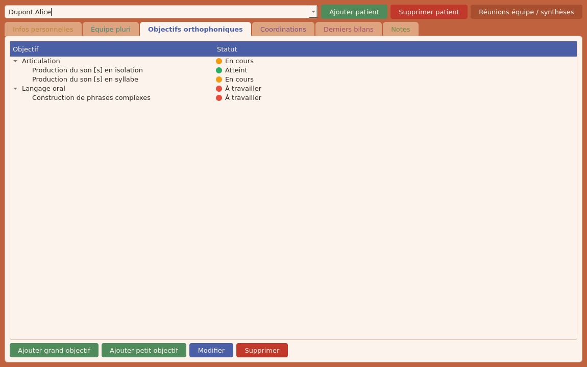
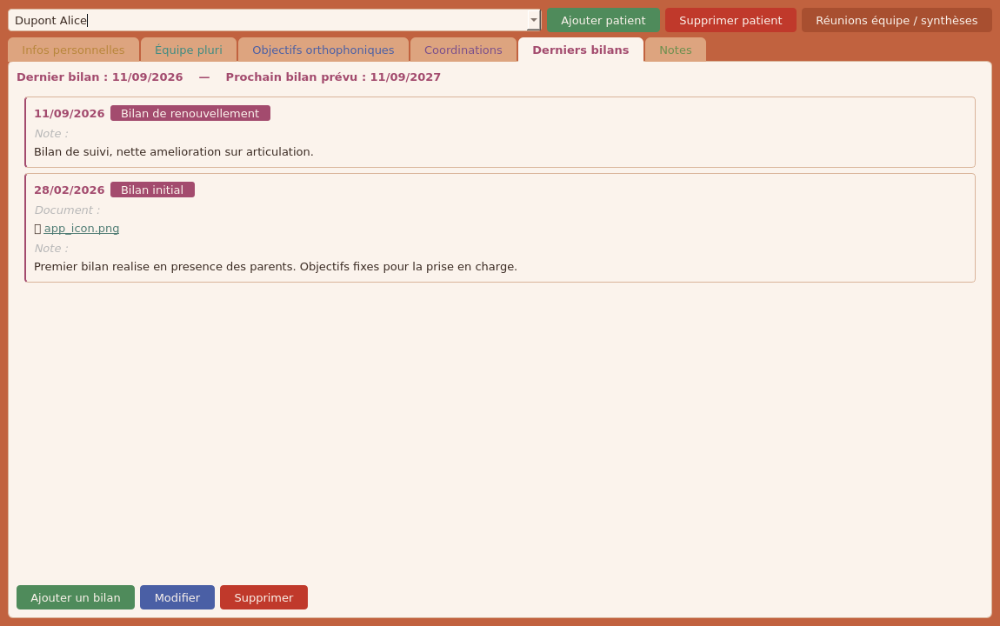

# Orthophonie App

Application desktop Windows pour orthophonistes : dossiers patients, suivi
des objectifs, bilans, et réunions d'équipe. Locale, chiffrée de bout en
bout, sans aucun service tiers ni connexion internet requise.

[](https://github.com/c-lemeunier/orthophonie_app/actions/workflows/build-windows.yml)


## Aperçu

<table>
<tr>
<td></td>
<td></td>
</tr>
</table>

## Installation (pour un utilisateur, sans rien connaître à l'informatique)

Pas besoin de Python, ni de rien installer d'autre : un seul fichier à
télécharger et à exécuter.

1. Ouvrez la page
   [dernière version disponible](https://github.com/c-lemeunier/orthophonie_app/releases/latest).
2. Dans la section "Assets" en bas de la page, téléchargez le fichier qui
   ressemble à `OrthophonieApp-Setup-X.Y.Z.exe`.
3. Double-cliquez sur le fichier téléchargé pour lancer l'installation.
4. Windows peut afficher un écran bleu "Windows a protégé votre ordinateur"
   (normal : l'application n'est pas signée par un éditeur payant reconnu).
   Cliquez sur **Informations complémentaires**, puis sur
   **Exécuter quand même**.
5. Suivez l'assistant d'installation (Suivant, Suivant, Installer). Un
   raccourci est créé sur le Bureau et dans le menu Démarrer.
6. Lancez l'application. Au tout premier démarrage, elle demande de créer un
   mot de passe et affiche un code de récupération : notez ce code sur
   papier (ou ailleurs que sur cet ordinateur) et gardez-le précieusement,
   il est indispensable si le mot de passe est oublié.

L'application fonctionne ensuite entièrement hors connexion, aucune donnée
ne quitte l'ordinateur.

## Pourquoi ce projet est intéressant

- **Chiffrement réel, pas cosmétique** : base SQLite chiffrée avec SQLCipher,
  clé de chiffrement générée aléatoirement et protégée par un schéma
  DEK/KEK (Argon2id + enveloppe Fernet). Changer de mot de passe ne
  nécessite pas de rechiffrer toute la base, et un code de récupération
  évite de tout perdre en cas de mot de passe oublié, sans jamais créer de
  porte dérobée.
- **Migrations sans framework** : pas d'Alembic, mais une petite routine
  d'auto-migration qui ajoute les colonnes manquantes au démarrage et
  convertit les anciennes données texte libre en véritables annuaires
  gérés (types de bilan, types de réunion), de façon idempotente.
- **Application 100% locale** : aucune donnée patient ne quitte le poste de
  l'utilisateur, ni service cloud, ni télémétrie.
- **Packaging complet** : build Windows automatisé (PyInstaller + Inno
  Setup) déclenché par tag Git, avec numéro de version extrait
  automatiquement du tag et publication en release GitHub.
- **Interface soignée** : thème de couleurs cohérent, code couleur constant
  pour les actions (ajouter, modifier, supprimer), recherche en direct,
  glisser-déposer de documents.

## Fonctionnalités en un coup d'œil

- Fiche patient complète : infos personnelles, âge calculé automatiquement,
  équipe pluridisciplinaire, objectifs orthophoniques hiérarchisés avec
  statut, coordinations, bilans (avec type et document joint), notes.
- Fenêtre réunions d'équipe et synthèses : tableau triable, recherche libre,
  types gérés par l'utilisateur.
- Annuaires réutilisables (intervenants, types de bilan, types de réunion) :
  recherche, ajout, renommage, suppression, sans jamais dupliquer la saisie.
- Écran de verrouillage par mot de passe local au démarrage.

Le détail complet des fonctionnalités, de l'architecture et des instructions
de build se trouve dans [`app/README.md`](app/README.md).

## Démarrage rapide (pour développer)

```bash
cd app
conda create -n orthophonie-app python=3.11
conda activate orthophonie-app
pip install -e ".[dev]"
python main.py
```

Voir [`app/README.md`](app/README.md) pour le développement complet, les
tests, et la production de l'exécutable Windows.

## Stack technique

Python 3.11, PySide6 (Qt), SQLAlchemy 2, SQLCipher, Argon2id, PyInstaller,
Inno Setup, GitHub Actions.
